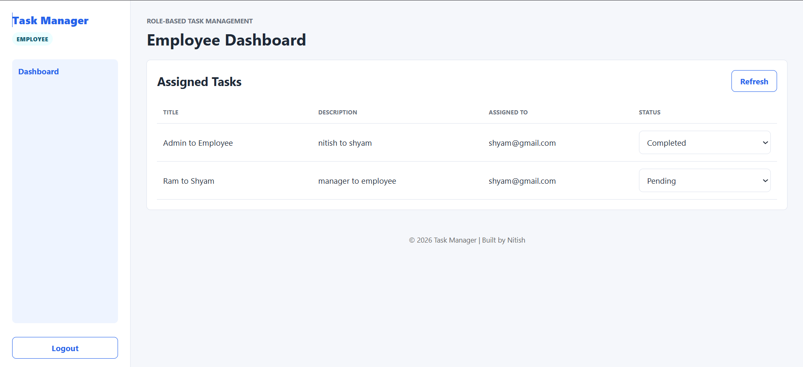
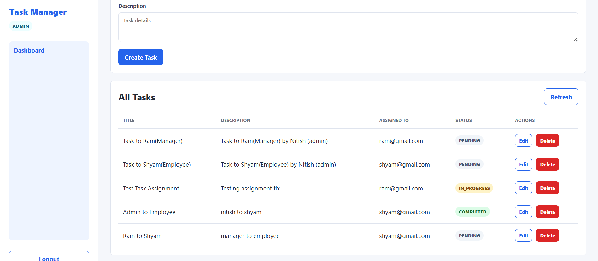
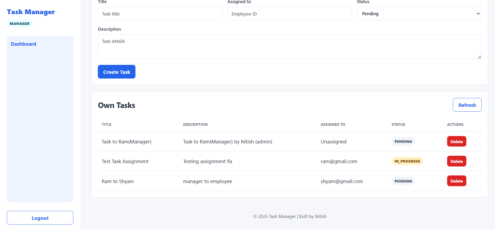

# 🚀 Task Manager Frontend

A modern **React-based task management application** with role-based access control and a clean, responsive UI.

---

## 🚀 Environment Setup

### 🔧 Local Development

1. Copy `.env.example` to `.env.local`

2. Set your backend URL:

   ```
   VITE_API_BASE_URL=http://localhost:8080
   ```

3. Install dependencies:

   ```bash
   npm install
   ```

4. Start development server:

   ```bash
   npm run dev
   ```

---

## 🚧 Deployment Status

> ⚠️ To be deployed

Deployment is currently in progress.

---

## 🌍 Environment Variables

* **Local Development** → `http://localhost:8080`
* **Production** → Will be configured after deployment

---

## 📸 Application Screenshots

### 📊 Dashboard



### 👑 Admin Dashboard



### 📋 Task Management



---

## 🎯 Features

* Role-based authentication (**Admin, Manager, Employee**)
* Task creation, update, and deletion
* Dynamic task status updates
* Responsive UI with Tailwind CSS
* Clean and modular component structure

---

## 🔄 Workflow & Role Permissions

### 👑 Admin

* Create tasks
* Delete **any task**
* Update task status
* Full system control

---

### 🧑‍💼 Manager

* Assign tasks to employees
* Create tasks
* Update task status
* Delete tasks **within their group only**
* ❗ Cannot delete Admin-created tasks

---

### 👨‍💻 Employee

* View assigned tasks
* Update task status
* ❌ Cannot create or delete tasks

---

### ⚙️ Permission Logic

* **Admin > Manager > Employee** (Hierarchy-based access)
* Deletion is restricted by **role + ownership**
* Managers have **limited control under Admin**
* Employees have **read + update access only**

---

## 🛠️ Tech Stack

* React 18
* Vite
* React Router
* Axios
* Tailwind CSS

---

## 📁 Project Structure

```
src/
├── api/           # API layer
├── components/    # Reusable UI components
├── constants/     # App constants
├── pages/         # Page-level components
├── routes/        # Protected routes
├── utils/         # Helper functions
└── styles.css     # Global styles
```

---

## 📌 Highlights

* Clean UI with proper role-based restrictions
* Integrated with secure Spring Boot backend
* Organized folder structure for scalability
* Production-ready frontend architecture

---

## 👨‍💻 Author

Nitish Kamati
